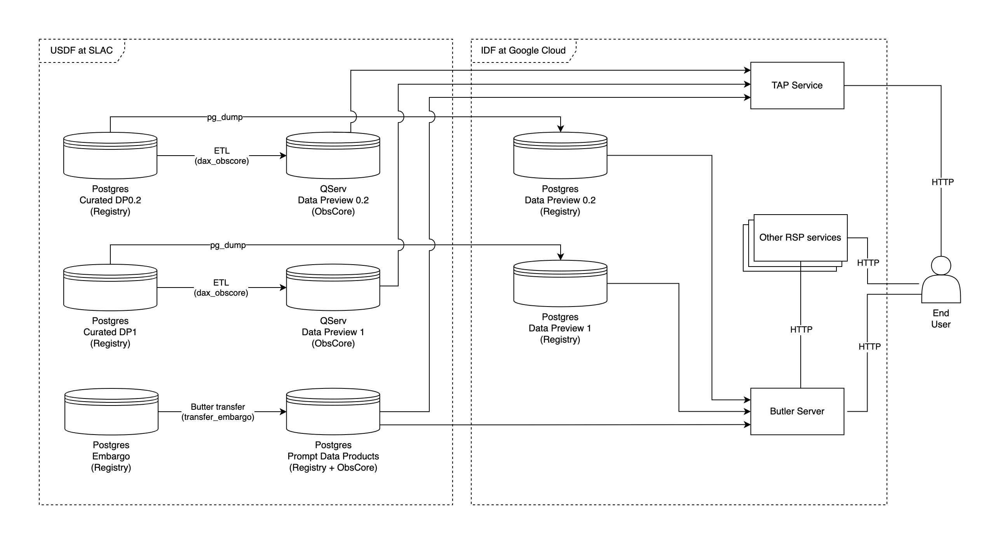

# Butler Databases for Community Science Users at the RSP

```{abstract}
Describes the database infrastructure that supports end-user access to Butler metadata via the Rubin Science Platform.
```

## Introduction

Rubin's [Data Butler](https://dmtn-229.lsst.io/) stores data files and the
metadata associated with them.  The Butler is involved in most end user access
to image data products via the [Rubin Science
Platform](https://data.lsst.cloud/) -- sometimes directly, and sometimes as a
source of data for other services.

There are several different Butler repositories that will be made available to
users over the next few years.  This document discusses the databases that host
the metadata associated with the Butler repositories.  Note that these metadata
databases are separate from the data files themselves -- the system used to
store the actual image data is not discussed here.

This document discusses only the Butler databases for end users on the Rubin
Science Platform. Not included in this document are:
* Butler databases used internally by the project team, except where public-facing databases are derived from the internal databases.
* Butler databases hosted by other institutions (which may contain the same data as the databases described here.)
* The filesystem containing the image data ("datastore" in Butler jargon).

## Taxonomy of Butler databases

There are multiple databases containing Butler metadata, spread between the
[USDF at SLAC](https://rtn-080.lsst.io/) and the [IDF at Google
Cloud](https://dmtn-209.lsst.io/).  Not all of these databases are configured
in the same way, and the next few sections discuss the ways in which they vary.

### Database access method

There are two primary methods of accessing Butler metadata, shown in the table
below.  These two access methods use two different database schemas.

| Access Method | Schema |
| ------------- | ------ |
| Butler library | Butler Registry |
| IVOA TAP service | ObsCore |

Confusingly, these two schemas sometimes co-exist in the same database and
sometimes are deployed separately.  Some considerations for how these databases
are configured for each deployment are described below.

#### Registry (supports Butler library)

The [Registry schema](https://dmtn-073.lsst.io/) supports access to Butler data
via the [Butler library](https://github.com/lsst/daf_butler) and [pipelines
framework](https://dmtn-229.lsst.io/).  It tracks the data files
generated by the telescope and science pipelines, along with metadata allowing
searches for files of interest.

A Registry database can be hosted using either Postgres or SQLite.  Large-scale
shared repositories are hosted using Postgres, while SQLite is used for smaller
personal repositories.

#### ObsCore (supports TAP)

ObsCore is an [IVOA standard](https://www.ivoa.net/documents/ObsCore/) defining
a set of observation metadata and a protocol for accessing it.  The metadata
for some Butler dataset types in the Registry can be presented as an ObsCore
table.

We currently have two ways to host ObsCore data derived from Butler metadata:
* Loaded into [QServ](https://dmtn-243.lsst.io/) alongside the LSST catalogs.
* Co-located in the same Postgres database as the Butler Registry, in a separate table.

In both of these cases, end users access the data via a [TAP
service](https://github.com/lsst-sqre/lsst-tap-service), [hosted in the Rubin
Science Platform](https://phalanx.lsst.io/applications/tap/index.html).

##### QServ

ObsCore via QServ is used for the annual data releases, because QServ provides
a spatially partitioned, scalable cluster of database instances.  When the data
release is made, [a script](https://github.com/lsst-dm/dax_obscore) is used to
convert metadata from the Butler Registry database into a format that can be
ingested by QServ.

QServ is not well-suited for dynamically updated data, so this setup is only
used for static data releases.

##### Co-located with Registry DB

The ObsCore table can also be hosted in Postgres, sharing a database with the
Butler Registry.  The Butler library can be configured with an ["ObsCore
Manager"](https://github.com/lsst/daf_butler/blob/50c0a9ef673d2b360f76026ea5d13829836f77b2/python/lsst/daf/butler/registry/obscore/_manager.py#L115)
that maintains an ObsCore table containing information about datasets in the
Registry.  As datasets are added through the usual Butler methods for updating
the Registry, the ObsCore table is updated simultaneously.

### Update modes

Different Butler repositories are updated at different cadences.  This affects:
* How data is loaded into the database
* How aggressively data can be cached by consumers
* Which databases can be used

Repositories may be entirely static, batch updated on a regular schedule, or
updated continuously as changes are made.

(static)=
#### Static

Data releases are generated in full before release to the public, and are not
changed after they are created.  This allows flexibility in hosting their
databases, because a separate public-facing database can be created by
bulk-loading a copy of the data.

For these databases, the Registry data will be hosted in Postgres via Google
Cloud SQL at the IDF. ObsCore data will be hosted in QServ at the USDF.

Because the data is not changed after it is deployed, Butler server can
aggressively cache frequently used tables and we can deploy multiple read
replicas to scale the database load.

See [below](#dp1) for more information about this
configuration for Data Preview 1 and subsequent data releases.

(batch-update)=
#### Batch update

The prompt data products repository will be updated nightly as new data is
released from embargo.  [A script](https://github.com/lsst-dm/transfer_embargo)
copies data from the internal embargo repository to a separate public
repository.

Because the data is updated in predictable ways at predictable times, the
Butler server can still aggressively cache data as long as we invalidate the
caches after the batch update.

There are technical limitations with both available methods for hosting ObsCore that makes it difficult
to host a frequently-changing ObsCore database:
* QServ is not designed for dynamic updates, so it cannot host ObsCore for a
  changing repository.
* For spatial indexing in Postgres, the ObsCore manager uses the [pg_sphere
Postgres extension](https://github.com/postgrespro/pgsphere).  This extension
is not available in Google Cloud SQL, and it is unlikely to be supported in the
future because it has few users outside of astronomy.

Consequently, we can currently only host a batch-updated ObsCore database in a 
Postgres deployment at USDF, where we have control over the extensions
available. (We could also host a custom Postgres deployment at Google using a
virtual machine or Kubernetes, but the Butler team lacks a database
administrator to manage this setup.)

#### Online, immediate update

Internal Butler databases used by the Rubin project team are updated constantly
as new data arrives from the summit and as pipeline processing finishes.  The
Butler library is used to perform these updates.

We do not currently plan to use this update mode to serve data generated by the
Rubin project to end-users.  

However, there is a requirement that we provide hosting for end users to share
data products that they have created.  For [Data Preview 0.2](#dp02) we allow
end-users to write directly into the Registry database, with changes
immediately visible to other users.

(dimension-universes)=
### Metadata Schema ("Dimension Universe")

Each Butler repository has a "Dimension Universe" defining the metadata values
that can be stored in the database, and the relationships between those values.

This "Dimension Universe" is tightly coupled to the science pipelines that
generate the data products tracked by the Butler.  It changes over time as the
pipelines evolve. As a result, different repositories will have different
universe versions.  Data Release repositories will use the version that was
current at the time the Data Release was made, while Prompt Data Products will
usually use the newest version.

## Butler database deployments

The following diagram shows the databases that will exist in mid-2025 to
support end user access to Butler data via the Rubin Science Platform:



Although end users will primarily access the data through services deployed at
the IDF in Google Cloud, the databases used by these services are split between
USDF and IDF.  There are separate databases for each Data Preview, each Data
Release, and for Prompt Data Products.  For each repository, there is a
Registry database and an ObsCore database.

(dp02)=
### Data Preview 0.2
* Status: Deployed
* Registry: Google Cloud SQL at IDF
* ObsCore: QServ at USDF
* Update mode: Static and online user-generated

[Data Preview 0.2](https://dp0-2.lsst.io/) contains data products simulating a
portion of the LSST survey.  It is hosted on the Rubin Science Platform to
allow community science users to become familiar with LSST data products and
the tools for accessing them.

The DP0.2 Butler Registry is hosted in Postgres via Google Cloud SQL.  It
tracks approximately 250 million datasets.  The data was bulk-loaded using
Postgres's `pg_restore` utility, from a database backup generated using
`pg_dump` on the database used to process the data at the USDF.

The DP0.2 data generated by the Rubin project is static, like future data
releases.  However, users are allowed to store information about their own
user-generated products in the same Registry database containing the Data
Preview data.  There are no access controls and all changes are immediately
visible to other users.

End users can access data in the Butler Registry using the Butler library, and
there are several [tutorial
notebooks](https://github.com/rubin-dp0/tutorial-notebooks) showing how to do
this.  This Butler Registry also backs other Rubin Science Platform services
like [vo-cutouts](https://github.com/lsst-sqre/vo-cutouts) and
[datalinker](https://github.com/lsst-sqre/datalinker/), which access it
indirectly through [Butler server](https://dmtn-283.lsst.io/).

ObsCore is hosted in QServ at the USDF, sharing a database with the catalog
portion of the Data Preview.  The data was exported from the Butler registry
using [dax_obscore](https://github.com/lsst-dm/dax_obscore) and ingested into
QServ.  This supports TAP queries through the Portal aspect, and can also be
accessed using other IVOA-standard TAP tools.

(dp1)=
### Data Preview 1
* Status: Planned for 2025
* Registry: Google Cloud SQL at IDF
* ObsCore: QServ at USDF
* Update mode: Static

[Data Preview 1](https://rtn-085.lsst.io/) contains data products derived from
real on-sky images taken during the commissioning of the telescope.

Following the completion of data processing for Data Preview 1, a "curated"
Registry database will be created at the USDF by the Campaign Management team.
This registry contains a cleaned-up version of the science pipelines outputs
with some intermediate datasets removed.

The public-facing version of the curated database will be hosted in Postgres
via Google Cloud SQL at the IDF. As in Data Preview 0.2, the data will be
transferred using `pg_dump` and `pg_restore` to make an independent copy of the
database.

Similar to Data Preview 0.2, ObsCore will be hosted in QServ at the USDF, using
data exported from the Registry using
[dax_obscore](https://github.com/lsst-dm/dax_obscore).

### Future data releases
* Status: Planned for future
* Registry: Google Cloud SQL or AlloyDB at IDF
* ObsCore: QServ at USDF
* Update mode: Static

The general pattern for future data releases will be similar to Data Preview 1:
the Registry will be hosted using Google-managed databases at IDF, and ObsCore
will be hosted in QServ at USDF.  The databases for each data release are
independent of the other data releases -- they will likely have different
[dimension universes](#dimension-universes) and thus incompatible database
schemas.

Because future data releases will be larger and have many more users, a single
node deployment of Postgres may not be sufficient to handle the load for the
Registry database. We may use multiple Postgres instances as read replicas. We
also plan to evaluate Google's [AlloyDB](https://cloud.google.com/alloydb),
which is a scalable Postgres-compatible database.

### Prompt data products
* Status: Planned for 2025
* Registry: Postgres at USDF
* ObsCore: In same Postgres as Registry at USDF
* Update mode: Batch

From the start of the survey, [prompt data products](https://lse-163.lsst.io/)
will be released to the community.  This will require Butler Registry and
ObsCore databases to support the same search functionality provided for the
data releases.

As data is released from [embargo](https://rtn-073.lsst.io), it is copied from
the embargo Butler repository to the public prompt data products repository
using the [`transfer_embargo` script](https://github.com/lsst-dm/transfer_embargo).
This update will run periodically -- perhaps as often as once every 15 minutes.

Initially, we plan to host both the Registry and ObsCore databases together in
a single Postgres database at the USDF.  As discussed [above](#batch-update),
we do not currently have a way to host ObsCore for this deployment anywhere but
the USDF.  We also do not currently have a way to maintain an ObsCore table
separate from the Registry, so it is expedient to have these databases together
at USDF.

A VPN or SSH tunnel to the services using this database at the IDF will secure
the connection to the database.

As the database grows, we may split the Registry database from the ObsCore
database and move the Registry database to IDF. This will reduce the round-trip
time for services using the Butler, and let us use the same Google database
hosting used for the data releases.  Because the ObsCore table includes
access URLs that require the Registry to resolve (via
[datalinker](https://github.com/lsst-sqre/datalinker/)), we must ensure
that the Registry is updated before the ObsCore table is updated.

### User-generated data
* Status: Not yet designed
* Registry: To be decided
* ObsCore: N/A
* Update mode: To be decided

There is a requirement that we provide a service allowing users to share their
own user-generated data products with each other, allowing them to access it
with the same tools used to access the data generated by the Rubin project.

There is currently an assumption that one aspect of this will be a
user-writeable Butler repository.  This assumption is based on a few details of
the current design of the system:
1. The science pipelines framework requires data to be stored in a Butler
repository, in order to find/load it for pipeline execution and store the outputs.
2. Many of the file types associated with the data releases are difficult to load without going through the Butler.
3. Several end-user-facing services use the Butler as a backend, and it would
   be useful to allow these services to consume user-generated data.

It is not yet clear how to host the Registry database for user-generated data,
but there are a few rough theories:
* It could be hosted in the same database as the project-generated data release.
* It could be hosted in a separate Postgres database or databases.
* Users could store a working copy of their data in a local SQLite database,
  with a way to push it to a shared central Postgres database in a batch.

All of these potential solutions have significant problems.

#### Same database as data release

There is one major advantage to allowing users to store data in the same
Registry database as the project-generated data releases.  It drastically
simplifies the story for allowing users to run portions of the LSST science
pipelines with their own data.  They could easily run pipelines combining
project-generated data with their own data, and write back the outputs to be
used by other users.

This comes with a long list of downsides:
* User modifications could impact our ability to reliably serve
  project-generated data.  If the data release database was static, query
  performance could be tested, understood, and optimized in advance of its public
  availability.  By allowing users to modify the database, we make the
  performance less predictable and may face an unexpected performance "cliff"
  as the database grows.
* Intermixing frequently-changing user data with a multi-terabyte static
 dataset complicates maintenance:
   - Backups become more expensive and difficult due to the increased database size.
   - Database upgrades and schema migrations become more difficult,
 potentially requiring significant downtime due to the large database size.  If
 the large, static portion of the database is separated from the changing
 portions, it could be migrated offline and switched when complete, instead of
 requiring downtime.  At the largest Butler repository at the USDF this has
 become an issue already -- we have a migration that has
 been pending for nearly a year due to the difficulty of completing it in an
 "online" environment.
* There is additional complexity required in the user interactions with the
framework, with namespaces required to segregate project-generated metadata
from user-generated metadata in things like dataset type names, collections,
and datasets.
* The metadata that users want to track for their own data products may not map
  well to the project-defined [dimension universe schema](#dimension-universes).
* Tying user-generated data to a specific data release would make it harder to
  share data derived from multiple data releases (or prompt data products.)
* The Butler library and pipeline framework depends on read-after-write
consistency in the database.  With database read replicas needed to
scale the database service, read-after-write consistency is harder to provide.
* Many pipeline runs are ephemeral, executed as part of experimentation or
 debugging.  Over time the database would fill up with outputs from runs that
 are no longer of interest.
* Performance details in the Butler internals often depend on the data being
structured "correctly" (not too many different dataset types, collection chains
not too long, etc.)
* Each data release is only supported for 2-3 years, and taking down the data
release would also take down the user-generated data.

#### Separate Postgres instance

Segregating user-generated data from the project-generated data in a separate database would alleviate many of the potential issues described above:
* The database would be smaller and easier to maintain.
* Unexpected performance issues would not impact the critical function of serving project-generated data.
* The lifetime of the user data is more easily separated from the data release cycle.

A number of the other issues mentioned above are not resolved just by separating the data release from the user data:
* Users are still stuck with the [dimension universe schema](#dimension-universes) defined by the project.
* We would still need namespacing to separate users from each other, and "work in progress" from "published data".
* With many users sharing the same database, scalability and the potential need for replication is still an issue.

Rather than a single shared Registry database, we could provide individual
users/groups with their own databases. (This would likely be implemented as
separate schemas in a shared server, rather than actual separate database
instances per user.)  This would alleviate the issues mentioned above, at the
cost of increased operational complexity in creating and maintaining many
individual databases.

There is one major problem with either of these approaches.  The pipelines
framework is not currently able to execute a run that combines data from
multiple input databases.  This would require that we either:
* Build tooling to copy metadata for any needed inputs from the data release database into the user database.
* Re-work the pipelines framework to eliminate this restriction.

#### Working copies in local SQLite databases

Another approach would be for individual users to use private SQLite registry
databases for work in progress, with a shared central server that they can
publish data to in a batch.

SQLite databases are stored in a file on the file system.  This has many of the
advantages of the individual Postgres database approach described above, but
gives users more flexibility because they can easily create as many databases
as they need, share them like they would any other file, and remove them
when they are no longer needed.

The downsides are:
* On the Rubin Science Platform, users do not have access to local disk --
 there is only a network filesystem with a small quota (tens of gigabytes).
* Tooling would be needed for copying inputs from the data release, and
publishing results back to the shared user database.
* No centralized maintenance is possible for schema updates -- users are responsible for their own databases.
* The local [dimension universe](#dimension-universes) would need to match the
shared database in order to publish data.